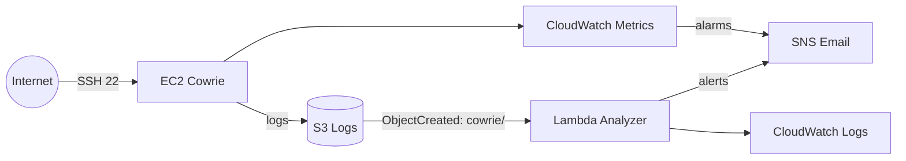

# DAMN-TEAMSSN - Honeypot en AWS (documentacion completa)

> **Despliegue público:** [Abrir despliegue](https://alonsomarcosm.github.io/DAMN-TEAMSSN/)

Infraestructura reproducible en AWS para un honeypot con Cowrie, logs en S3, analisis con Lambda, alertas por SNS y alarmas CloudWatch. Este README unifica toda la documentacion del proyecto.

## 1) Objetivo y alcance
- Levantar un honeypot SSH (Cowrie) en EC2.
- Guardar evidencias en S3.
- Analizar logs con Lambda y enviar alertas por SNS.
- Monitorizar el estado basico de la instancia con CloudWatch.
- Entregar IaC reproducible con Terraform y scripts en PowerShell.

## 2) Arquitectura


## 3) Decisiones tecnicas
- SSH 22 expuesto para el honeypot.
- Telnet deshabilitado por simplicidad.
- Admin real por SSM (`enable_ssm=true`); si se desactiva, SSH en 22222 con CIDR restringido.
- IP publica estable via EIP.
- Logs sincronizados a S3 cada 5 minutos via cron.
- Bucket S3 con cifrado SSE-S3 y bloqueo de acceso publico.
- `force_destroy=true` en bucket para laboratorios.

## 4) Workflow de equipo
- Rama por persona (ej: `feature/alonso-hito1`).
- PR obligatorio hacia `main`, revisado por otro miembro.
- Sufijo unico por persona: `amm`, `nlr`, `mpg`, `dtm`.
- Prefijo de recursos: `proy-damn-teamssn`.
- Tags: `Project=DAMN-TEAMSSN`, `Owner=<suffix>`, `Env=dev`.

## 5) Estructura del repo
- `infra/`: Terraform raiz y modulos.
- `src/lambda/analyzer/`: codigo Lambda.
- `scripts/`: automatizacion PowerShell.
- `envs/`: tfvars y plantillas.
- `docs/`: documentacion adicional.

## 6) Requisitos
- Terraform >= 1.5
- AWS CLI
- PowerShell (Windows)
- Cuenta AWS laboratorio (region us-east-1)

## 7) Credenciales AWS (no se versionan)
Plantilla: `envs/aws_credentials.example`.

Ubicaciones:
- Windows: `C:\Users\<user>\.aws\credentials`
- Linux/Mac: `~/.aws/credentials`

Crear perfil:
```
aws configure --profile <nombre>
aws sts get-caller-identity --profile <nombre>
```
Si no quieres escribir `--profile` en cada comando:
```
$env:AWS_PROFILE="<nombre>"
```

## 8) Configuracion por persona (tfvars)
1) Copia un ejemplo:
```
Copy-Item .\envs\alonso.tfvars.example .\envs\alonso.tfvars
```
2) Edita `envs/alonso.tfvars`:
- `resource_suffix` (unico).
- `admin_email` (SNS).
- `aws_profile`, `aws_region`.
- `allowed_admin_cidr` (solo si desactivas SSM).
- `existing_instance_profile_name` / `existing_lambda_role_arn` si no tienes permisos IAM.

## 9) Despliegue y destruccion
```
.\scripts\up.ps1 -Env alonso
```
```
.\scripts\down.ps1 -Env alonso
```

## 10) Outputs
```
.\scripts\show_outputs.ps1 -Env alonso
```
Guarda `public_ip`, `instance_id`, `s3_bucket`, `sns_topic_arn`, `lambda_name`.
Nota: `public_ip` se mantiene por la EIP, pero `instance_id` cambia si reemplazas el EC2.

## 11) Verificacion tecnica (Cowrie y SSM)
```
aws ssm describe-instance-information --filters Key=InstanceIds,Values=<instance_id> --profile <aws_profile>
```
```
aws ssm send-command --instance-ids <instance_id> --document-name "AWS-RunShellScript" --parameters file://scripts/ssm_cowrie_check_ascii.json --profile <aws_profile>
```
Salida esperada:
- `systemctl is-active cowrie` = `active`
- `twistd` escuchando en `:22`

## 12) Prueba final (pipeline completo)
1) Confirma la suscripcion SNS en el email del `admin_email`.
2) Intento SSH controlado:
```
ssh -o StrictHostKeyChecking=no -o UserKnownHostsFile=/dev/null -o BatchMode=yes -o ConnectTimeout=5 -p 22 fakeuser@<public_ip>
```
3) Forzar sync a S3:
```
aws ssm send-command --instance-ids <instance_id> --document-name "AWS-RunShellScript" --parameters file://scripts/ssm_cowrie_sync.json --profile <aws_profile>
```
4) Ver objetos en S3:
```
aws s3 ls s3://<s3_bucket>/cowrie/<suffix>/
```
5) Ver logs de Lambda:
```
aws logs tail /aws/lambda/proy-damn-teamssn-analyzer-<suffix> --since 10m --profile <aws_profile>
```
6) Verificar emails:
- Alerta SNS del honeypot.
- OK/ALARM de CloudWatch (si cambia el estado).

Si no llega alerta, sube eventos hasta superar umbrales y vuelve a sincronizar:
```
1..10 | ForEach-Object { ssh -o StrictHostKeyChecking=no -o UserKnownHostsFile=/dev/null -o BatchMode=yes -o ConnectTimeout=3 -p 22 fakeuser@<public_ip> }
aws ssm send-command --instance-ids <instance_id> --document-name "AWS-RunShellScript" --parameters file://scripts/ssm_cowrie_sync.json --profile <aws_profile>
aws logs tail /aws/lambda/proy-damn-teamssn-analyzer-<suffix> --since 10m --profile <aws_profile>
```

## 13) Runbook rapido (comandos en orden)
Parametrizado:
```
scripts\up.ps1 -Env <env>
scripts\show_outputs.ps1 -Env <env>
ssh -o StrictHostKeyChecking=no -o UserKnownHostsFile=/dev/null -o BatchMode=yes -o ConnectTimeout=5 -p 22 fakeuser@<public_ip>
aws ssm send-command --instance-ids <instance_id> --document-name "AWS-RunShellScript" --parameters file://scripts/ssm_cowrie_sync.json --profile <aws_profile>
aws s3 ls s3://<s3_bucket>/cowrie/<suffix>/
aws logs tail /aws/lambda/proy-damn-teamssn-analyzer-<suffix> --since 10m --profile <aws_profile>
scripts\down.ps1 -Env <env>
```
Ejemplo real:
```
scripts\up.ps1 -Env alonso
scripts\show_outputs.ps1 -Env alonso
ssh -o StrictHostKeyChecking=no -o UserKnownHostsFile=/dev/null -o BatchMode=yes -o ConnectTimeout=5 -p 22 fakeuser@54.236.128.229
aws ssm send-command --instance-ids i-04b9ab0c57e0a2446 --document-name "AWS-RunShellScript" --parameters file://scripts/ssm_cowrie_sync.json --profile alonso
aws s3 ls s3://proy-damn-teamssn-logs-amm2-851725275441/cowrie/amm2/
aws logs tail /aws/lambda/proy-damn-teamssn-analyzer-amm2 --since 10m --profile alonso
scripts\down.ps1 -Env alonso
```

## 14) Reemplazar solo el EC2 (user_data nuevo)
```
terraform -chdir=infra apply -var-file=.\envs\alonso.tfvars -replace=module.honeypot_ec2.aws_instance.honeypot -auto-approve
```

## 15) Troubleshooting rapido
- BucketAlreadyExists:
  - Cambia `resource_suffix`.
- SNS no llega:
  - Revisa `PendingConfirmation` con `aws sns list-subscriptions-by-topic`.
  - Acepta el email.
- Lambda sin log group:
  - No se ha invocado; sube logs a S3 primero.
- SSH "connection refused":
  - Cowrie no esta activo; revisa con SSM.
- Error Python incompatible:
  - Cowrie requiere Python 3.11 en Amazon Linux 2023.
- Duplicado `listen_endpoints`:
  - Revisar `cowrie.cfg` si hubo cambios manuales.

## 16) Scripts utiles
- `scripts\up.ps1` / `scripts\down.ps1`
- `scripts\show_outputs.ps1`
- `scripts\ssm_cowrie_check_ascii.json`
- `scripts\ssm_cowrie_sync.json`
