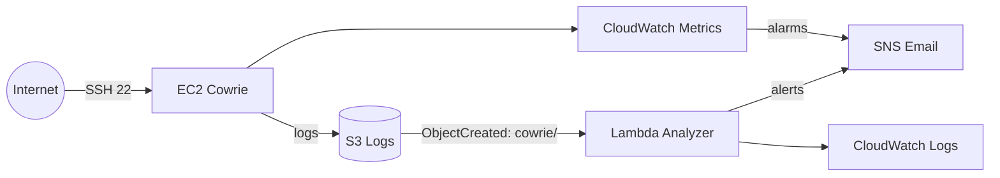

# Arquitectura (Hito 1)

Infraestructura honeypot minima en AWS con ingesta de logs, analisis y alertas.

```mermaid
flowchart LR
  Internet((Internet)) -->|SSH 22| EC2[EC2 Cowrie]
  EC2 -->|logs| S3[(S3 Logs)]
  S3 -->|ObjectCreated: cowrie/| Lambda[Lambda Analyzer]
  Lambda -->|alerts| SNS[SNS Email]
  Lambda --> CWLogs[CloudWatch Logs]
  EC2 --> CW[CloudWatch Metrics]
  CW -->|alarms| SNS
```
