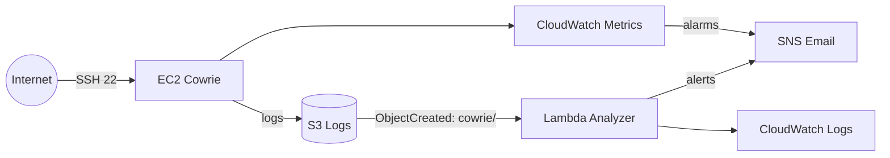

# Sistemas y Servicios en la Nube - DAMN-TEAMSSN
# Documento maestro de la practica (Curso 2024/2025)

Este documento resume todo lo necesario para entender el repositorio, desplegar la practica y preparar el informe final.

## 1) Caso de uso y objetivos
Caso de uso: Honeypot SSH en AWS para detectar actividad sospechosa.

Objetivos de la asignatura:
- Aprender el uso de servicios AWS.
- Desarrollar una aplicacion en AWS.
- Construir una arquitectura desacoplada con al menos 2 servicios AWS.

Objetivos del proyecto:
- Levantar un honeypot SSH (Cowrie) en EC2.
- Almacenar evidencias en S3.
- Analizar logs con Lambda.
- Enviar alertas por SNS.
- Monitorizar con CloudWatch.

Servicios usados:
- EC2, S3, Lambda, SNS, CloudWatch, VPC, IAM (roles).

## 2) Arquitectura y componentes

### Diagrama (mermaid)


### Componentes
- EC2 (Amazon Linux 2023) con Cowrie escuchando en 22.
- S3 con prefijo `cowrie/<suffix>/` para logs.
- Lambda `proy-damn-teamssn-analyzer-<suffix>` para analizar eventos y alertar.
- SNS para notificaciones por email.
- CloudWatch para alarmas de CPU y status check.
- VPC con subnet publica y EIP estable.

## 3) Implementacion (resumen tecnico)

### Infraestructura (Terraform)
Ubicacion: `infra/` y `infra/modules/*`
- Networking (VPC, subnet, route table, IGW).
- S3 con cifrado SSE-S3, bloqueo publico, lifecycle.
- EC2 con user_data para instalar Cowrie y sincronizar logs.
- Lambda con permisos S3, CloudWatch Logs y SNS.
- SNS topic + suscripcion email.
- CloudWatch alarms.

Variables clave (tfvars):
- `resource_suffix`: sufijo unico para recursos.
- `admin_email`: email de alertas SNS.
- `aws_profile`, `aws_region`.
- `enable_ssm`: recomendado true.
- `existing_instance_profile_name`, `existing_lambda_role_arn` (si no hay permisos IAM).

### Lambda (analizador)
Ubicacion: `src/lambda/analyzer/app.py`
Funcion:
- Lee logs de S3.
- Cuenta eventos, top IPs, usuarios y contrasenas.
- Compara con `threshold_total` y `threshold_per_ip`.
- Publica alerta a SNS si supera umbrales.

### Cowrie (EC2)
Instalacion automatizada en `infra/modules/honeypot_ec2/user_data.sh`:
- Python 3.11 + venv.
- Cowrie instalado en editable.
- Servicio systemd con `twistd`.
- Configuracion `listen_endpoints` sin duplicados.
- Sync a S3 cada 5 minutos.

## 4) Repositorio
Estructura:
- `infra/`: Terraform raiz y modulos.
- `src/`: Lambda analyzer.
- `scripts/`: `up.ps1`, `down.ps1`, `show_outputs.ps1`.
- `envs/`: tfvars y ejemplos.
- `docs/runbook.md`: secuencia de comandos.
- `README.md`: documentacion completa.

## 5) Despliegue y prueba final (resumen)
La secuencia completa esta en `docs/runbook.md`.
En resumen:
1) Configurar AWS CLI (`aws configure --profile <perfil>`).
2) `scripts\up.ps1 -Env alonso`
3) `scripts\show_outputs.ps1 -Env alonso`
4) SSH controlado a la IP publica.
5) Forzar sync de logs con SSM.
6) Verificar objetos en S3.
7) Ver logs de Lambda.
8) Confirmar email SNS.

Si no llega alerta (umbrales no alcanzados), fuerza eventos con varios intentos SSH:
```
1..10 | ForEach-Object { ssh -o StrictHostKeyChecking=no -o UserKnownHostsFile=/dev/null -o BatchMode=yes -o ConnectTimeout=3 -p 22 fakeuser@<public_ip> }
aws ssm send-command --instance-ids <instance_id> --document-name "AWS-RunShellScript" --parameters file://scripts/ssm_cowrie_sync.json --profile <aws_profile>
aws logs tail /aws/lambda/proy-damn-teamssn-analyzer-<suffix> --since 10m --profile <aws_profile>
```

## 6) Resultados esperados
- Cowrie activo y escuchando en 22.
- Logs en S3 bajo `cowrie/<suffix>/`.
- Lambda procesando logs (CloudWatch Logs).
- Email de alerta SNS cuando se supera umbral.
- Alarmas CloudWatch funcionando (OK/ALARM).

## 7) Costes (estimacion a 12 meses)
Requiere calculo en AWS Pricing Calculator:
- EC2 t3.micro (us-east-1).
- S3 almacenamiento de logs.
- Lambda invocaciones.
- SNS emails.
- CloudWatch logs/alarms.

Pasos:
1) Abrir AWS Pricing Calculator.
2) Configurar servicios anteriores en us-east-1.
3) Ajustar uso mensual estimado.
4) Exportar estimacion y adjuntarla al informe.

## 8) Entregables
1) Repositorio en GitHub con codigo e infraestructura.
2) Informe escrito (max 15 paginas) con:
   - Introduccion de la aplicacion.
   - Arquitectura y componentes (diagrama).
   - Detalles de implementacion.
   - Resultados, prestaciones y costo anual estimado.

## 9) Referencias de la asignatura
[1] 10 fun hands-on projects to learn AWS
[2] Serverless Land
[3] Tutoriales practicos de AWS
[4] Top 15 AWS Project Ideas in 2024

## 10) Notas finales
- La suscripcion SNS se debe confirmar cada despliegue nuevo.
- Los tokens AWS temporales caducan: renovar cuando falle `aws sts get-caller-identity`.
- Si hay `BucketAlreadyExists`, cambiar `resource_suffix`.
